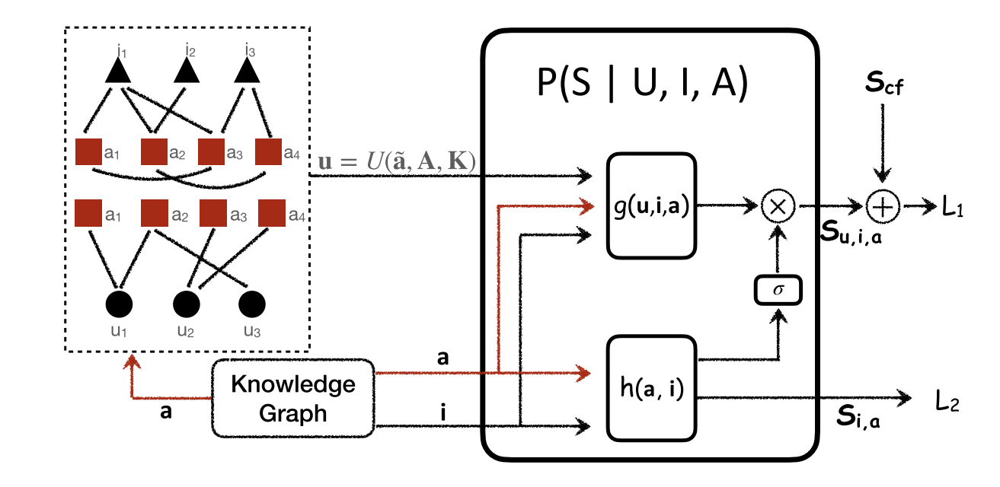

# Causal Inference for Knowledge Graph based Recommendation

> A novel Knowledge Graph-based Causal Recommendation (KGCR) framework that addresses biases in KG-based recommender systems by employing causal inference principles.

---
## Authors

**Yinwei Wei**<sup>1</sup>, **Xiang Wang**<sup>2</sup>, **Liqiang Nie**<sup>1</sup>\*, **Shaoyu Li**<sup>1</sup>, **Dingxian Wang**<sup>3</sup>, **Tat-Seng Chua**<sup>2</sup>

<sup>1</sup> Shandong University, China  
<sup>2</sup> National University of Singapore, Singapore  
<sup>3</sup> Meituan, China  
\* Corresponding author

---

## Links

- **Paper**: [`TKDE 2023`](https://ieeexplore.ieee.org/document/9996555)
- **Code Repository**: [`GitHub`](https://github.com/weiyinwei/KGCR)

---

## Table of Contents

- [Updates](#updates)
- [Introduction](#introduction)
- [Highlights](#highlights)
- [Method / Framework](#method--framework)
- [Project Structure](#project-structure)
- [Installation](#installation)
- [Dataset / Benchmark](#dataset--benchmark)
- [Usage](#usage)
- [Citation](#citation)

---

## Updates

- [12/2022] Paper accepted to IEEE Transactions on Knowledge and Data Engineering (TKDE).


---

## Introduction

This is the official PyTorch implementation for the paper **Causal Inference for Knowledge Graph based Recommendation**.

Knowledge Graph (KG) based recommender systems face two primary challenges: the entanglement of user preferences with the inherent KG structure, and the bias in similarity scoring. In this work, we develop a new framework termed **Knowledge Graph-based Causal Recommendation (KGCR)** to address these challenges by applying causal inference principles to recommender systems. 

Specifically, KGCR implements deconfounded user preference learning to resolve the negative impacts of structural information, and adopts counterfactual inference to eliminate the bias in the user-item similarity scoring. By explicitly modeling the causal relationships between key variables in the recommendation process, KGCR provides more accurate and less biased recommendations.

---

## Highlights

- **Causal Inference Perspective**: Addresses biases in KG-based recommender systems by employing causal inference principles.
- **Deconfounded Learning**: Implements deconfounded user preference learning to disentangle true user preferences from the KG structure.
- **Counterfactual Inference**: Adopts counterfactual inference to eliminate bias in similarity scores.
- **Strong Performance**: Outperforms several state-of-the-art baselines, such as KGNN-LS, KGAT, and KGIN, across multiple datasets (Amazon-book, Last-FM, and Yelp2018).

---

## Method / Framework



---

## Project Structure

```
.
├── Dataset.py             # Data loading and processing script
├── Full_rank.py           # Full-ranking evaluation logic
├── KGCR.py                # Core model implementation of KGCR
├── Metric.py              # Evaluation metrics (Recall, NDCG, etc.)
├── Train.py               # Training loops and optimization
├── main.py                # Main entry point for running experiments
└── README.md
```

## Installation
### Clone the repository

git clone [https://github.com/weiyinwei/KGCR.git](https://github.com/weiyinwei/KGCR.git)
cd KGCR

### Environment Requirements
The code has been tested running under Python. The required packages typically include:

* PyTorch
* numpy
* scipy
* scikit-learn

---
## Dataset

Please check the MMGCN repository for access to the datasets. Due to copyright restrictions, we could only provide toy datasets for validation. If you need the complete ones, please contact the owners of the respective datasets

---

## Usage
You can run the model via the main script. The instruction of commands can be found in the codes.

---

Citation
If you use this code or our proposed model in your research, please consider citing:

```
@article{wei2023causal,
  title={Causal inference for knowledge graph based recommendation},
  author={Wei, Yinwei and Wang, Xiang and Nie, Liqiang and Li, Shaoyu and Wang, Dingxian and Chua, Tat-Seng},
  journal={IEEE Transactions on Knowledge and Data Engineering},
  volume={35},
  number={11},
  pages={11854--11865},
  year={2023},
  publisher={IEEE}
}
```
